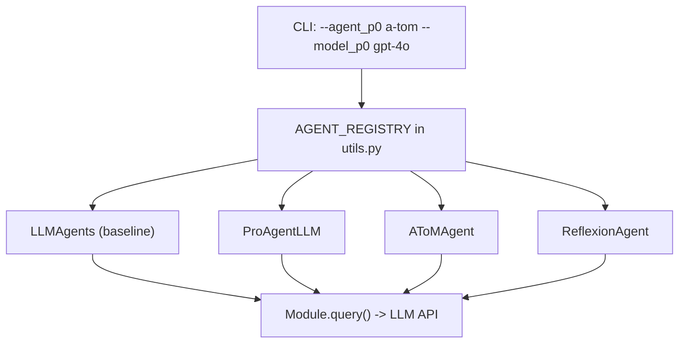

# Agent Architecture Registry + Decoupled Model Calls

## Current state

- `--p0` / `--p1` selects transport (`LLMPair` | `Human`); `--model_p0` / `--model_p1` selects LLM
- All LLM agents use the same `LLMAgents` class and identical prompts
- `make_agent()` in [src/utils.py](src/utils.py) has a flat `if/elif` on `alg`
- Prompts assembled in `LLMAgents.load_prompt_file()` via `prompt.txt` skeleton + rule files
- `teammate_intentions_dict` exists in `LLMAgents.__init__` but is **unused** (good hook point)

## Architecture



Each agent subclass overrides **only** prompt assembly and/or the action loop. The model backend (`Module.query`) is unchanged -- it just receives different prompts from different architectures.

## Key files to modify

- [src/main.py](src/main.py) -- new CLI flags, agent metadata in JSON
- [src/utils.py](src/utils.py) -- agent registry + updated `make_agent`
- [src/collab/collab.py](src/collab/collab.py) -- new agent subclasses (or new file)
- [src/prompts/agents/](src/prompts/agents/) -- architecture-specific prompt overlays (new dir)
- [src/compile_experiment_run.py](src/compile_experiment_run.py) -- parse `agent_type` metadata

## Step-by-step

### Step 1: CLI flags + agent registry

**[src/main.py](src/main.py)** argparse block (around line 347):
- Add `--agent_p0` and `--agent_p1` with `choices=['baseline', 'proagent', 'a-tom', 'reflexion']`, default `'baseline'`
- Pass `agent_type` into `make_agent` alongside existing kwargs
- Keep `--p0` / `--p1` for transport layer (`LLMPair` vs `Human` vs `Greedy`)

**[src/utils.py](src/utils.py)** `make_agent`:
- Add an `AGENT_REGISTRY` dict mapping string names to classes
- `make_agent` gains `agent_type` param; looks up class from registry; falls back to `LLMAgents` for `"baseline"`
- All existing kwargs (`model`, `actor`, `retrival_method`, etc.) pass through unchanged

```python
AGENT_REGISTRY = {
    "baseline":  LLMAgents,
    "proagent":  ProAgentLLM,
    "a-tom":     AToMAgent,
    "reflexion": ReflexionAgent,
}
```

### Step 2: Base infrastructure for subclasses

**New file: [src/collab/agents.py](src/collab/agents.py)**

All new agent types live here, importing from `collab.py`. Each subclass of `LLMAgents`:
- Inherits `__init__`, `set_agent_index`, `reset`, and the full action/validation loop
- Stores `self.agent_type = "proagent"` (etc.) for logging
- Overrides `load_prompt_file()` to append architecture-specific text after the base prompt assembly
- Optionally overrides `action()` to add pre/post reasoning steps

Add `self.agent_type = "baseline"` to `LLMAgents.__init__` in [src/collab/collab.py](src/collab/collab.py) so all agents carry this attribute.

### Step 3: Prompt overlay system

**New directory: `src/prompts/agents/`** with subdirectories per architecture:

```
src/prompts/agents/
  proagent/
    belief_correction.txt      # injected into {communication_rule} or appended
  a-tom/
    partner_model.txt          # ToM prediction instructions
    partner_output_format.txt  # adds partner_prediction field to output
  reflexion/
    episode_memory.txt         # cross-episode reflection template
```

Each subclass's `load_prompt_file()`:
1. Calls `super().load_prompt_file(mode)` to get the base prompt
2. Reads its overlay file(s)
3. Appends/injects the overlay text at a defined point (after `{communication_rule}` block, before the output format section, or as an additional output field)

### Step 4: ProAgentLLM subclass

**Overrides in `ProAgentLLM(LLMAgents)`:**
- `load_prompt_file()`: After base assembly, append `belief_correction.txt` content which adds to the output format: "Before your analysis, state what you predict your partner will do next and why."
- `action()`: After calling `super().action()` logic for teammate ML action tracking (line ~603 in collab.py where `teammate_ml_actions` is updated), compare last prediction vs actual. Store mismatch in `self.belief_corrections` list.
- `generate_state_prompt()` or the observation builder: Inject belief correction feedback ("Last prediction: X, Actual: Y, Prediction was wrong/correct") into the next timestep's observation.
- Uses the existing `teammate_intentions_dict` (currently unused) to store predictions.

**Prompt overlay (`belief_correction.txt`):**
```
BELIEF TRACKING:
Before planning, you must predict your partner's next action based on their 
recent behavior and the current state. After observing their actual action, 
note whether your prediction was correct. Use mismatches to update your 
understanding of your partner's strategy.

Add this field BEFORE your analysis:
    {role} partner_prediction: [predicted action and reasoning]
```

### Step 5: AToMAgent subclass

**Overrides in `AToMAgent(LLMAgents)`:**
- `load_prompt_file()`: Append `partner_model.txt` which adds explicit Theory of Mind instructions and a `partner_prediction` output field
- `action()`: Before the main `generate_ml_action` call, optionally issue a lightweight "predict partner" query (or bake it into the same call via the output format). After the step, compare prediction to `state.ml_actions[other]`.
- Track prediction accuracy over time in `self.tom_accuracy` (rolling window)
- Feed accuracy history back into prompt: "Your partner prediction accuracy: X/Y correct over last N steps"

Key difference from ProAgent: A-ToM explicitly reasons about the **depth** of partner modeling ("Is my partner modeling me? Should I account for that?"). The prompt overlay includes ToM-order awareness.

### Step 6: ReflexionAgent subclass

**Overrides in `ReflexionAgent(LLMAgents)`:**
- `__init__()`: Add `self.episode_memory = []` (persists across episodes within a run)
- `reset()`: After calling `super().reset(teammate)`, if `self.episode_memory` is non-empty, inject memories into prompt
- After each episode (wired from `main.py`), call `self.generate_episode_reflection(statistics)` which:
  1. Summarizes the episode trajectory (success/fail, errors, what worked)
  2. Generates a 2-3 sentence reflection via one LLM call
  3. Appends to `self.episode_memory`
- `load_prompt_file()`: Prepend episode memories to the `Lessons from Past Failures` section (which already exists in the observation but is currently `[]`)

**main.py change**: After each episode loop, if agent is ReflexionAgent, call its reflection method before next episode.

### Step 7: JSON logging + save directory

**[src/main.py](src/main.py)** metadata section (~line 219):
- Add `"agent_type"` to each entry in `statistics_dict["agents"]`:

```python
statistics_dict["agents"] = [
    {
        "player": "P0", "index": 0, "role": "chef",
        "agent_type": variant["agent_p0"],
        **_agent_backend_meta(team.agents[0]),
    },
    ...
]
```

- Update `_save_models_dir_segment` to include agent type in the directory name:
  `a-tom_gpt-4o__baseline_claude-sonnet-4-20250514` instead of just `gpt-4o__claude-sonnet-4-20250514`

### Step 8: Update compile_experiment_run.py

**[src/compile_experiment_run.py](src/compile_experiment_run.py)**:
- `run_summary()`: Extract `agent_type` from the `agents` list (handle both old format without `agent_type` and new format with it)
- Add `p0_agent_type` and `p1_agent_type` columns to output CSVs
- The `_agents_models` helper already handles list-of-dicts format; extend it to also pull `agent_type`

### Step 9: Validation

- Run baseline: `python main.py --agent_p0 baseline --model_p0 gpt-4o --agent_p1 baseline --model_p1 claude-sonnet-4-20250514 --order boiled_egg`
- Run proagent: same but `--agent_p0 proagent`
- Verify JSON output contains `agent_type` field
- Verify `compile_experiment_run.py` parses the new field
- Verify prompts differ between baseline and proagent runs (check logged `content.content` for belief prediction text)
